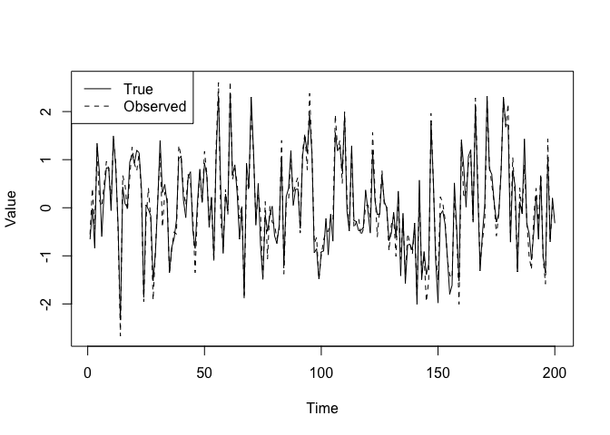
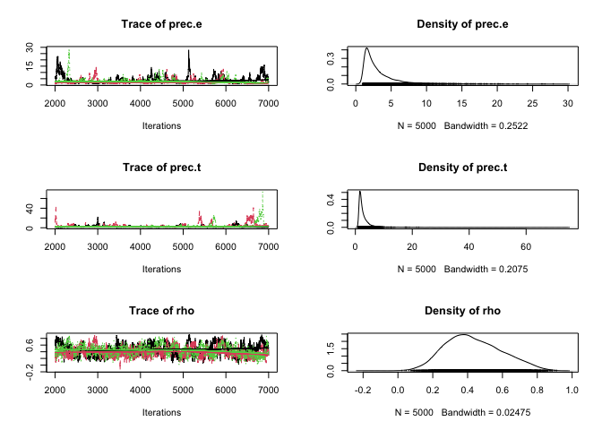
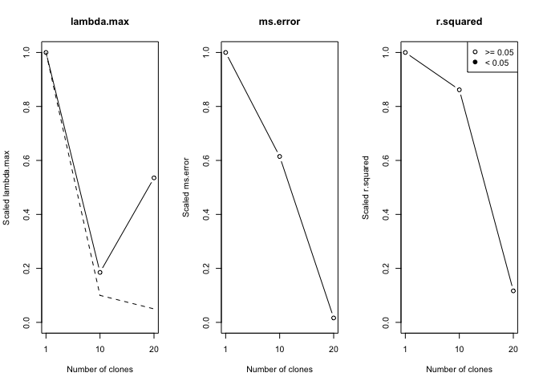
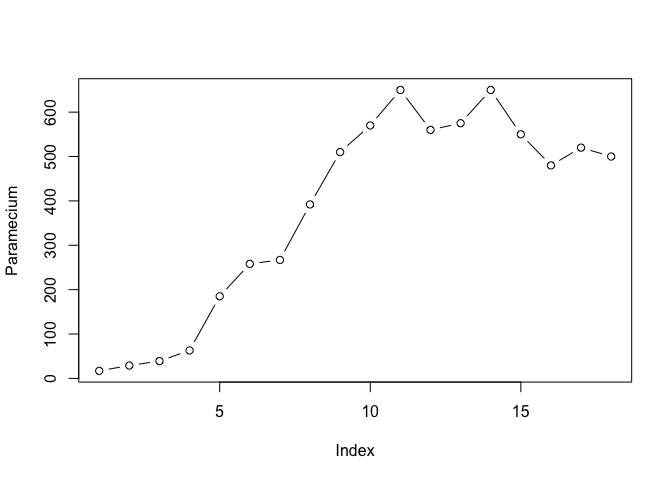
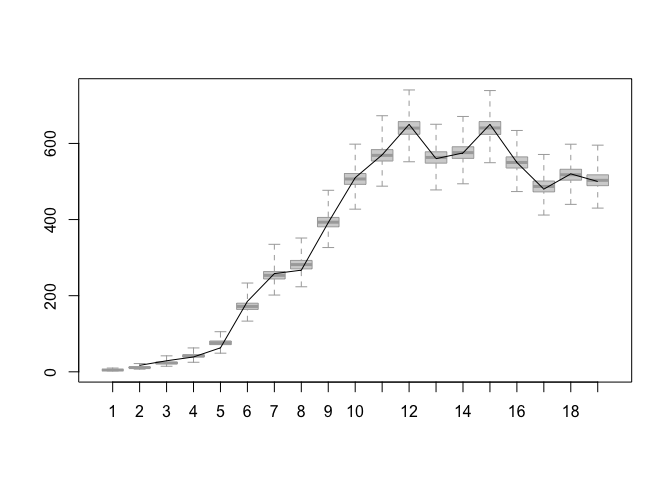
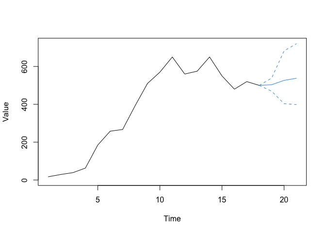

Time series and spatial data
================

## Introduction

In this part, we will demonstrate how one can use MCMC and data cloning
to analyze time series data sets. These examples can be extended to
longitudinal data sets, spatial data sets quite easily.

These models also tend to have missing observations. The code can be
modified easily to account for the missing observations for estimating
the parameters. We may also want to *predict* the values of the missing
observations. We will demonstrate how to predict missing data or
forecast future observations.

## Auto-regression of order 1 (AR(1) process)

This is one of the most basic time series models. The AR(1) model can be
written as:


where

and
")
are indepedent random variables (*N* is shorthand for the Normal
distribution).

This model says that the next year’s value is related to the past year’s
value. That is, the value in the past year is a good predictor for the
next year’s value. Hence the term ‘auto-regression’. This model can be
used to model many different phenomena that proceed in time. For
example, tomorrow’s temperature can be predicted using today’s
temperature (except in Alberta!). Next day’s stock price is likely to be
related to today’s price and so on.

This model can be modified to include covariates. Hence, we can write:

+\epsilon_{i}")

This allows for correlated environmental noise in regression.

This model has been used to model changes in wildlife populations. It is
useful in epidemiology and so on. Many econometric models are derived
from this basic model.

Of course, reality is most of the times more complicated than this
model. For example, one may not observe the response without error. This
is called an observation error. We may not (most of the times, we will
not) observe the true population size but only an estimate (or an index)
of the true population size. Thus, the observed value is not the true
response. Such cases are modelled using a hierarchical structure:

- Hierarchy 1 (True state model):
  
- Hierarchy 2 (Observation model):
  
  where
   is
  observation error and
  ")
  are independent random variables

This is what is called a ‘Kalman filter’ after a famous Hungarian
electrical engineer, Professor Rudolf Kalman. This is a particular case
of the model class ‘State space models’. They consist of at least two
hierarchies: one models the true underlying phenomenon and the other the
observation process that models the error due to observation process.

Under the Normal distribution assumption, the mathematics can be worked
out for the simple linear model to conduct the likelihood inference. But
once we enter the non-linear time series modelling or non-Gaussian
observation processes, mathematics become nearly impossible. We will see
an example of this a bit later. It will also illustrate why the MCMC
algorithm is considered one of the greatest inventions in modern
science.

For the time being, let us avoid all the mathematics and see if we can
use JAGS and dclone to conduct the statistical analysis.

> No math please!!! – this is our motto.

``` r
library(dclone)
```

    ## Loading required package: coda

    ## Loading required package: parallel

    ## Loading required package: Matrix

    ## dclone 2.3-2      2023-07-02

``` r
T_max = 200  # Number of time steps
rho = 0.3
sigma.e = 1
tau.e = 0.25
X = rep(0, T_max)

# This is the stationary distribution for the AR(1) process
X[1] = rnorm(1, 0, sigma.e/sqrt(1-rho^2))

for (t in 2:(T_max)){
  X[t] = rho*X[t-1] + rnorm(1, 0, sigma.e)
}

# Add observation error
Y = rnorm(length(X), X, tau.e)

plot(Y, type="l", lty=2, xlab="Time", ylab="Value")
lines(X)
legend("topleft", lty=c(1, 2), legend=c("True", "Observed"))
```

<!-- -->

We will start with the Bayesian approach.

``` r
AR1_Bayes_model = function(){
  # Likelihood
  prec.1 <- (1-rho*rho) * prec.e
  X[1] ~ dnorm(0, prec.1)
  Y[1] ~ dnorm(X[1], prec.t)
  for (t in 2:T_max){
    mu[t] <- rho * X[(t-1)]
    X[t] ~ dnorm(mu[t], prec.e)
    Y[t] ~ dnorm(X[t], prec.t)
  }
  # Priors
  rho ~ dunif(-1, 1)
  prec.e ~ dgamma(0.1, 0.1)
  prec.t ~ dgamma(0.1, 0.1)
}
```

Get the data and run the analysis.

``` r
Y = as.vector(Y)
dat = list(Y=Y, T_max=T_max)
ini = list(X=Y)
AR1_Bayes_fit = jags.fit(data=dat, params=c("rho","prec.e","prec.t"), model=AR1_Bayes_model)
```

    ## Registered S3 method overwritten by 'R2WinBUGS':
    ##   method            from  
    ##   as.mcmc.list.bugs dclone

    ## Compiling model graph
    ##    Resolving undeclared variables
    ##    Allocating nodes
    ## Graph information:
    ##    Observed stochastic nodes: 200
    ##    Unobserved stochastic nodes: 203
    ##    Total graph size: 610
    ## 
    ## Initializing model

``` r
summary(AR1_Bayes_fit)
```

    ## 
    ## Iterations = 2001:7000
    ## Thinning interval = 1 
    ## Number of chains = 3 
    ## Sample size per chain = 5000 
    ## 
    ## 1. Empirical mean and standard deviation for each variable,
    ##    plus standard error of the mean:
    ## 
    ##          Mean     SD Naive SE Time-series SE
    ## prec.e 3.1567 2.4894 0.020326         0.2055
    ## prec.t 3.4158 4.0533 0.033095         0.4355
    ## rho    0.4351 0.1598 0.001305         0.0111
    ## 
    ## 2. Quantiles for each variable:
    ## 
    ##          2.5%    25%    50%    75%  97.5%
    ## prec.e 1.1082 1.6117 2.3461 3.7936  9.927
    ## prec.t 1.2076 1.6486 2.1942 3.4437 15.978
    ## rho    0.1587 0.3173 0.4188 0.5452  0.764

``` r
plot(AR1_Bayes_fit)
```

<!-- -->

We will modify this to get the MLE using data cloning.

``` r
AR1_DC_model = function(){
  # Likelihood
  for (k in 1:ncl){
    X[1,k] ~ dnorm(0, prec.1)
    Y[1,k] ~ dnorm(X[1,k], prec.t)
    for (t in 2:T_max){
        mu[t,k] <- rho*X[(t-1),k]
        X[t,k] ~ dnorm(mu[t,k], prec.e)
        Y[t,k] ~ dnorm(X[t,k], prec.t)
    }
  }
  # Priors
  rho ~ dunif(-1, 1)
  prec.e ~ dgamma(0.1, 0.1)
  prec.t ~ dgamma(0.1, 0.1)
  prec.1 <- (1-rho*rho) * prec.e
}
```

Get the data and run the analysis with data cloning.

``` r
Y = array(Y, dim=c(length(Y), 1))
Y = dcdim(Y)
dat = list(Y=Y, T_max=T_max, ncl=1)
ini = list(X=Y)
initfn = function(model, n.clones){
  return(list(X=dclone(Y, n.clones)))
}
AR1_DC_fit = dc.fit(data=dat,params=c("rho","prec.t","prec.e"),model=AR1_DC_model,
    unchanged="T_max",multiply="ncl",
    n.clones=c(1, 10, 20),
    inits=ini, initsfun=initfn)
```

    ## 
    ## Fitting model with 1 clone 
    ## 
    ## Compiling model graph
    ##    Resolving undeclared variables
    ##    Allocating nodes
    ## Graph information:
    ##    Observed stochastic nodes: 200
    ##    Unobserved stochastic nodes: 203
    ##    Total graph size: 611
    ## 
    ## Initializing model
    ## 
    ## 
    ## Fitting model with 10 clones 
    ## 
    ## Compiling model graph
    ##    Resolving undeclared variables
    ##    Allocating nodes
    ## Graph information:
    ##    Observed stochastic nodes: 2000
    ##    Unobserved stochastic nodes: 2003
    ##    Total graph size: 6002
    ## 
    ## Initializing model
    ## 
    ## 
    ## Fitting model with 20 clones 
    ## 
    ## Compiling model graph
    ##    Resolving undeclared variables
    ##    Allocating nodes
    ## Graph information:
    ##    Observed stochastic nodes: 4000
    ##    Unobserved stochastic nodes: 4003
    ##    Total graph size: 11992
    ## 
    ## Initializing model

    ## Warning in dclone::.dcFit(data, params, model, inits, n.clones, multiply =
    ## multiply, : chains convergence problem, see R.hat values

``` r
summary(AR1_DC_fit)
```

    ## 
    ## Iterations = 2001:7000
    ## Thinning interval = 1 
    ## Number of chains = 3 
    ## Sample size per chain = 5000 
    ## Number of clones = 20
    ## 
    ## 1. Empirical mean and standard deviation for each variable,
    ##    plus standard error of the mean:
    ## 
    ##          Mean      SD   DC SD  Naive SE Time-series SE R hat
    ## prec.e 1.7707 0.47048  2.1040 0.0038414        0.08506 1.696
    ## prec.t 4.6430 3.19005 14.2663 0.0260466        0.67326 2.298
    ## rho    0.3537 0.06813  0.3047 0.0005563        0.01300 1.761
    ## 
    ## 2. Quantiles for each variable:
    ## 
    ##         2.5%    25%    50%    75%   97.5%
    ## prec.e 1.176 1.3596 1.7073 2.0455  2.8937
    ## prec.t 1.908 2.5224 3.2373 5.7124 13.8889
    ## rho    0.248 0.2954 0.3518 0.4024  0.4937

``` r
dcdiag(AR1_DC_fit)
```

    ##   n.clones lambda.max  ms.error  r.squared    r.hat
    ## 1        1   19.23884 93.200655 0.59940927 1.090107
    ## 2       10    3.56299 57.289407 0.51650974 1.231858
    ## 3       20   10.29904  1.526551 0.06992688 1.901308

``` r
plot(dcdiag(AR1_DC_fit))
```

<!-- -->

Try running the above code when true `rho=0`.

- Are the parameters estimable?
- Does the Bayesian approach tell you that?

Without the estimability diagnostics, you could be easily mislead by the
Bayesian approach. You will merrily go around with the scientific
inference when the parameters are not estimable.

## Different types of measurement errors

1: Clipped or Censored time series

Suppose the underlying process is AR(1) but the observed process is a
clipped process such that it is 1 if
 is positive and 0 if
 is negative. This is
called a clipped time series. Similarly you may observe
 to belong to an
interval. This is an interval censored data. The above model can be
modified to accommodate such a process. An easier way to model binary,
count or proportion time series is as follows.

### Modelling binary and count data time series

For modelling binary time series, we can consider the observation
process as:

")
where
=\gamma*X_{t}")

For modelling count data time series, we can consider

")
where
.

This is a time series generalization of the GLMM that we considered
before.

*Caveat*: It is extremely important that you check for the estimability
of the parameters for these models. Because of clipping and other
observation processes, you are more likely to run into estimability
issues. As far as we know, data cloning is the only method that allows
estimability diagnostics as part of the estimation process. See Lele
([2010](https://github.com/datacloning/workshop-2023-edmonton/blob/main/docs/lele-2010-built-on-sand.pdf)).

### Non-linear time series analysis

Now we will consider a non-linear time series model, Beverton-Holt
growth model, that is commonly used in ecology.

In ecology and population biology, one wants to understand how abundance
changes over time. Following Malthus’ thinking, it is also evident that,
in a finite environment, abundance cannot increase without limit.

Thus, the growth is usually exponential at the beginning (low
population, ignore the Allee effect for now) and then it slows down as
we approach the carrying capacity. One commonly used model is the
Beverton-Holt model (discrete analog to the continuous Logistic model):

Let
=X_{t}")
where  is the
abundance at time . A
general form for the population growth models is:


where  is
")
random variable. This is similar to the AR(1) process but with a
non-linear mean structure.

If
+x_{t}-log(1+\beta N_{t})"),
the population growth model is called the Beverton-Holt model. It has an
upper limit

called the Carrying capacity, the maximum population size that can be
attained (with some perturbation).

In practice, we usually have to conduct some sampling to *estimate* the
abundance. Hence there is measurement error. We can represent this
process by using hierarchical model:

- Hierarchy 1: Process model,
  ,\sigma^{2})")
- Hierarchy 2: Observation model,
  ")

One can use other observation models as well. We can write the
likelihood function for this using a

(length of the time series) dimensional integral. If the time series is
of length 30, this will be a 30 dimensional integral. In order to
compute the MLE, we will need to evaluate this integral repeatedly until
the numerical optimization routine converges. This is a nearly
impossible task.

The code to analyze this non-linear time series with non-Gaussian
observation error can be written as follows.

``` r
BH_Bayes_fn= function() {
  # Likelihood
  X[1] ~ dnorm(mu0, 1 / sigma^2) # Initial condition
  for(i in 2:(n+1)){
    Y[(i-1)] ~ dpois(exp(X[i])) 
    X[i] ~ dnorm(mu[i], 1 / sigma^2) 
    mu[i] <- X[(i-1)] + log(lambda) - log(1 + beta * exp(X[(i-1)]))
  }

  # Priors on model parameters: They are on the real line.
  ln.beta ~ dnorm(0, 0.1) 
  ln.sigma ~ dnorm(0, 0.1)
  ln.tmp ~ dnorm(0, 0.1)

  # Parameters on the natural scale
  beta <- exp(ln.beta)
  sigma <- exp(ln.sigma)
  tmp <- exp(ln.tmp)
  lambda <- tmp + 1
  mu0 <- log(2)  + log(lambda) - log(1 + beta * 2)
}
```

Gause’s *Paramecium* data.

``` r
Paramecium = c(17,29,39,63,185,258,267,392,510,570,650,560,575,650,550,480,520,500)
plot(Paramecium, type="b")
```

<!-- -->

Bayesian analysis.

``` r
Y = Paramecium
dat = list(n=length(Y), Y=Y)
BH_Bayes_fit = jags.fit(data=dat, params=c("ln.tmp","ln.beta","ln.sigma"), model=BH_Bayes_fn)
```

    ## Compiling model graph
    ##    Resolving undeclared variables
    ##    Allocating nodes
    ## Graph information:
    ##    Observed stochastic nodes: 18
    ##    Unobserved stochastic nodes: 22
    ##    Total graph size: 167
    ## 
    ## Initializing model

``` r
summary(BH_Bayes_fit)
```

    ## 
    ## Iterations = 2001:7000
    ## Thinning interval = 1 
    ## Number of chains = 3 
    ## Sample size per chain = 5000 
    ## 
    ## 1. Empirical mean and standard deviation for each variable,
    ##    plus standard error of the mean:
    ## 
    ##             Mean     SD Naive SE Time-series SE
    ## ln.beta  -6.1655 0.1708 0.001394       0.004776
    ## ln.sigma -1.9612 0.2804 0.002290       0.006987
    ## ln.tmp    0.1479 0.1282 0.001047       0.003700
    ## 
    ## 2. Quantiles for each variable:
    ## 
    ##             2.5%      25%     50%     75%   97.5%
    ## ln.beta  -6.5298 -6.26212 -6.1581 -6.0563 -5.8534
    ## ln.sigma -2.4898 -2.15525 -1.9698 -1.7727 -1.3896
    ## ln.tmp   -0.1219  0.07414  0.1516  0.2285  0.3952

We can easily modify this program to obtain the MLE and its asymptotic
variance.

``` r
BH_DC_fn= function() {
  # Likelihood
  for (k in 1:ncl) {
    for(i in 2:(n+1)){
      Y[(i-1), k] ~ dpois(exp(X[i, k])) 
      X[i, k] ~ dnorm(mu[i, k], 1 / sigma^2) 
      mu[i, k] <- X[(i-1), k] + log(lambda) - log(1 + beta * exp(X[(i-1), k]))
    }
    X[1, k] ~ dnorm(mu0, 1 / sigma^2) 
  }

  # Priors on model parameters: They are on the real line.
  ln.beta ~ dnorm(0, 0.1) 
  ln.sigma ~ dnorm(0, 0.1)
  ln.tmp ~ dnorm(0, 0.1)

  # Parameters on the natural scale
  beta <- exp(ln.beta)
  sigma <- exp(ln.sigma)
  tmp <- exp(ln.tmp)
  lambda <- tmp + 1
  mu0 <- log(2)  + log(lambda) - log(1 + beta * 2)
}
```

Assemble the data and fit with data cloning.

``` r
Y = array(Y, dim=c(length(Y), 1))
Y = dcdim(Y)
dat = list(ncl=1, n=18, Y=Y)

n.clones = c(1, 5, 10)
params = c("ln.tmp", "ln.beta", "ln.sigma")
BH_MLE = dc.fit(data=dat, params=params, model=BH_DC_fn,
    n.clones=n.clones,
    multiply="ncl", unchanged="n",
    n.chains=5, n.update=1000, n.iter=5000, n.adapt=2000)
```

    ## 
    ## Fitting model with 1 clone 
    ## 
    ## Compiling model graph
    ##    Resolving undeclared variables
    ##    Allocating nodes
    ## Graph information:
    ##    Observed stochastic nodes: 18
    ##    Unobserved stochastic nodes: 22
    ##    Total graph size: 168
    ## 
    ## Initializing model
    ## 
    ## 
    ## Fitting model with 5 clones 
    ## 
    ## Compiling model graph
    ##    Resolving undeclared variables
    ##    Allocating nodes
    ## Graph information:
    ##    Observed stochastic nodes: 90
    ##    Unobserved stochastic nodes: 98
    ##    Total graph size: 752
    ## 
    ## Initializing model
    ## 
    ## 
    ## Fitting model with 10 clones 
    ## 
    ## Compiling model graph
    ##    Resolving undeclared variables
    ##    Allocating nodes
    ## Graph information:
    ##    Observed stochastic nodes: 180
    ##    Unobserved stochastic nodes: 193
    ##    Total graph size: 1482
    ## 
    ## Initializing model

``` r
dcdiag(BH_MLE)
```

    ##   n.clones  lambda.max    ms.error    r.squared    r.hat
    ## 1        1 0.076791263 1.771575445 0.1043622695 1.001911
    ## 2        5 0.014456623 0.031478843 0.0034257544 1.002636
    ## 3       10 0.007343637 0.002648009 0.0003956896 1.004777

Parameters for this model are estimable. It will be interesting to see
if one can use Negative Binomial distribution (one additional parameter)
instead of the Poisson distribution. Are the parameters still estimable?
(TBD!!!)

## Prediction

We are also interested in predicting the true population abundances as
well as forecasting the future trajectory of the abundances. This is
quite easy under the Bayesian paradigm. The frequentist paradigm
involves an additional step.

Let us see how to use the Bayesian paradigm and MCMC to do this. In the
Bayesian paradigm, there is no difference between parameters and the
unobserved states. They both are considered random variables.

On the other hand, in the frequentist paradigm parameters are fixed but
unknown (not random) whereas the unobserved states are true random
variables.

We (the instructors) consider these to be different.

1.  Information about the parameters converges to infinity as the sample
    size increases. Thus, we can *estimate* them with high degree of
    confidence. The *confidence* intervals shrink as we increase the
    sample size.
2.  Information about the states (random variables) does not converge to
    infinity as the sample size increases. The *prediction* intervals do
    not shrink.

This should be familiar to most of you from your regression class.

``` r
BH_Bayes_fn= function() {
  # Likelihood
  X[1] ~ dnorm(mu0, 1 / sigma^2) # Initial condition
  N[1] <- exp(X[1])
  for(i in 2:(n+1)){
    Y[(i-1)] ~ dpois(exp(X[i])) 
    X[i] ~ dnorm(mu[i], 1 / sigma^2) 
    mu[i] <- X[(i-1)] + log(lambda) - log(1 + beta * exp(X[(i-1)]))
    N[i] <- exp(X[i])
  }

  # Priors on model parameters: They are on the real line.
  ln.beta ~ dnorm(0, 0.1) 
  ln.sigma ~ dnorm(0, 0.1)
  ln.tmp ~ dnorm(0, 0.1)

  # Parameters on the natural scale
  beta <- exp(ln.beta)
  sigma <- exp(ln.sigma)
  tmp <- exp(ln.tmp)
  lambda <- tmp + 1
  mu0 <- log(2)  + log(lambda) - log(1 + beta * 2)
}

# Gause's data 
Y = Paramecium
dat = list(n=length(Y), Y=Y)
BH_Bayes_fit = jags.fit(data=dat, params=c("N"), model=BH_Bayes_fn)
```

    ## Compiling model graph
    ##    Resolving undeclared variables
    ##    Allocating nodes
    ## Graph information:
    ##    Observed stochastic nodes: 18
    ##    Unobserved stochastic nodes: 22
    ##    Total graph size: 167
    ## 
    ## Initializing model

``` r
summary(BH_Bayes_fit)
```

    ## 
    ## Iterations = 2001:7000
    ## Thinning interval = 1 
    ## Number of chains = 3 
    ## Sample size per chain = 5000 
    ## 
    ## 1. Empirical mean and standard deviation for each variable,
    ##    plus standard error of the mean:
    ## 
    ##          Mean      SD Naive SE Time-series SE
    ## N[1]    4.799  0.6422 0.005244        0.01053
    ## N[2]   11.365  1.7135 0.013990        0.03556
    ## N[3]   23.472  3.0604 0.024988        0.05813
    ## N[4]   41.995  4.3837 0.035793        0.06511
    ## N[5]   76.240  7.0717 0.057740        0.10708
    ## N[6]  172.450 11.9197 0.097324        0.16266
    ## N[7]  253.809 14.3708 0.117337        0.16224
    ## N[8]  281.659 16.4355 0.134195        0.21604
    ## N[9]  393.443 18.4453 0.150605        0.19555
    ## N[10] 506.987 21.2076 0.173159        0.23070
    ## N[11] 569.046 22.5695 0.184279        0.24304
    ## N[12] 641.013 24.6694 0.201425        0.27671
    ## N[13] 563.313 22.1500 0.180854        0.23527
    ## N[14] 576.154 22.7870 0.186055        0.24410
    ## N[15] 640.933 24.6383 0.201171        0.27706
    ## N[16] 550.203 21.7091 0.177254        0.22418
    ## N[17] 487.264 21.0950 0.172240        0.22424
    ## N[18] 518.035 21.2488 0.173496        0.22254
    ## N[19] 503.456 21.2177 0.173242        0.22730
    ## 
    ## 2. Quantiles for each variable:
    ## 
    ##          2.5%     25%     50%     75%   97.5%
    ## N[1]    3.745   4.366   4.717   5.148   6.283
    ## N[2]    8.706  10.138  11.133  12.339  15.393
    ## N[3]   18.443  21.292  23.165  25.292  30.396
    ## N[4]   33.931  38.997  41.794  44.769  51.053
    ## N[5]   62.454  71.484  76.159  80.967  90.250
    ## N[6]  150.873 164.003 171.811 180.242 197.487
    ## N[7]  226.808 243.951 253.442 263.341 282.633
    ## N[8]  249.779 270.404 281.674 292.597 314.043
    ## N[9]  358.164 380.945 393.051 405.600 430.209
    ## N[10] 466.545 492.501 506.674 521.007 549.305
    ## N[11] 525.120 553.819 568.698 583.778 614.390
    ## N[12] 594.287 624.086 640.288 657.340 691.368
    ## N[13] 519.899 548.244 563.216 578.024 607.563
    ## N[14] 532.815 560.795 575.815 591.259 622.074
    ## N[15] 593.588 623.714 640.678 657.433 690.395
    ## N[16] 508.655 535.451 550.021 564.639 593.274
    ## N[17] 447.087 472.743 486.974 501.206 529.677
    ## N[18] 477.020 503.556 517.749 532.097 559.931
    ## N[19] 462.558 489.060 503.102 517.519 546.298

``` r
boxplot(unname(as.matrix(BH_Bayes_fit)), range=0, border="darkgrey")
lines(c(NA, Y))
```

<!-- -->

If we want to obtain predictions that are invariant to parameterization
and correct in the frequentist sense, we need to modify this approach
slightly. We need to change the prior distribution to the asymptotic
distribution of the MLE. This can be done quite easily as follows.

``` r
BH_DC_pred_fn= function() {
  # Likelihood
  X[1] ~ dnorm(mu0, 1 / sigma^2) # Initial condition
  N[1] <- exp(X[1])
  for(i in 2:(n+1)){
    Y[(i-1)] ~ dpois(exp(X[i])) 
    X[i] ~ dnorm(mu[i], 1 / sigma^2) 
    mu[i] <- X[(i-1)] + log(lambda) - log(1 + beta * exp(X[(i-1)]))
    N[i] <- exp(X[i])
  }

  # Priors on model parameters: they are on the real line.
  parms ~ dmnorm(MuPost,PrecPost)
  ln.beta <- parms[1] 
  ln.sigma <- parms[2]
  ln.tmp <- parms[3]

  # Parameters on the natural scale
  beta <- exp(ln.beta)
  sigma <- exp(ln.sigma)
  tmp <- exp(ln.tmp)
  lambda <- tmp + 1
  mu0 <- log(2)  + log(lambda) - log(1 + beta * 2)
}

# Gause's data 
Y = Paramecium
dat = list(n=length(Y), Y=Y, MuPost=coef(BH_MLE), PrecPost=solve(vcov(BH_MLE)))
BH_DC_Pred = jags.fit(data=dat, params=c("N"), model=BH_DC_pred_fn)
```

    ## Compiling model graph
    ##    Resolving undeclared variables
    ##    Allocating nodes
    ## Graph information:
    ##    Observed stochastic nodes: 18
    ##    Unobserved stochastic nodes: 20
    ##    Total graph size: 180
    ## 
    ## Initializing model

``` r
summary(BH_DC_Pred)
```

    ## 
    ## Iterations = 2001:7000
    ## Thinning interval = 1 
    ## Number of chains = 3 
    ## Sample size per chain = 5000 
    ## 
    ## 1. Empirical mean and standard deviation for each variable,
    ##    plus standard error of the mean:
    ## 
    ##          Mean      SD Naive SE Time-series SE
    ## N[1]    4.708  0.5457 0.004456       0.009901
    ## N[2]   10.979  1.4344 0.011712       0.034082
    ## N[3]   22.891  2.7318 0.022305       0.056569
    ## N[4]   41.936  4.1605 0.033971       0.067204
    ## N[5]   77.104  6.6148 0.054010       0.118315
    ## N[6]  170.556 11.3071 0.092322       0.165314
    ## N[7]  252.775 13.9912 0.114238       0.154866
    ## N[8]  283.346 15.3894 0.125654       0.251930
    ## N[9]  393.343 17.9663 0.146695       0.199515
    ## N[10] 506.670 20.8367 0.170131       0.219295
    ## N[11] 569.207 22.1188 0.180600       0.230733
    ## N[12] 639.369 24.1949 0.197551       0.265627
    ## N[13] 564.146 22.3347 0.182362       0.238042
    ## N[14] 576.622 22.9630 0.187492       0.245725
    ## N[15] 639.654 24.4492 0.199627       0.275234
    ## N[16] 550.848 22.0922 0.180382       0.225771
    ## N[17] 488.182 20.3370 0.166051       0.225871
    ## N[18] 518.248 21.4355 0.175020       0.222914
    ## N[19] 504.062 21.2851 0.173792       0.223825
    ## 
    ## 2. Quantiles for each variable:
    ## 
    ##          2.5%     25%     50%     75%   97.5%
    ## N[1]    3.755   4.338   4.662   5.032   5.902
    ## N[2]    8.591   9.986  10.837  11.830  14.176
    ## N[3]   18.134  21.032  22.665  24.513  28.878
    ## N[4]   34.334  39.069  41.787  44.605  50.543
    ## N[5]   64.672  72.499  76.985  81.542  90.371
    ## N[6]  149.425 162.872 170.137 177.906 194.086
    ## N[7]  226.635 243.201 252.334 261.779 281.273
    ## N[8]  254.225 272.622 283.173 293.489 313.988
    ## N[9]  359.130 381.241 392.903 405.298 429.534
    ## N[10] 466.338 492.479 506.375 520.386 548.209
    ## N[11] 526.926 554.176 568.937 584.209 613.274
    ## N[12] 592.775 622.489 639.024 655.600 687.251
    ## N[13] 520.844 548.789 563.862 579.294 609.130
    ## N[14] 532.505 561.234 576.131 591.644 623.145
    ## N[15] 593.080 622.910 639.471 656.265 687.985
    ## N[16] 508.311 535.736 550.771 565.761 594.636
    ## N[17] 449.153 474.055 487.914 501.850 528.510
    ## N[18] 477.326 503.612 517.945 532.662 561.227
    ## N[19] 463.354 489.576 503.775 517.991 546.769

``` r
boxplot(unname(as.matrix(BH_DC_Pred)), range=0, border="darkgrey")
lines(c(NA, Y))
```

<!-- -->

If we want to forecast future observations, we modify the program
slightly. To do this, we pretend as if the process had run longer than

but we could not ‘observe’ those future states. Thus, it becomes a
missing data problem. Let us see how we can do this.

``` r
BH_Bayes_fn= function() {
  X[1] ~ dnorm(mu0, 1 / sigma^2) # Initial condition
  N[1] <- exp(X[1])
  for(i in 2:(n+1)){
    Y[(i-1)] ~ dpois(exp(X[i]))
  }
  for (i in 2:N_future){
    X[i] ~ dnorm(mu[i], 1 / sigma^2) 
    mu[i] <- X[(i-1)] + log(lambda) - log(1 + beta * exp(X[(i-1)]))
    N[i] <- exp(X[i])
  }

  # Priors on model parameters: they are on the real line.
  ln.beta ~ dnorm(0, 0.1) 
  ln.sigma ~ dnorm(0, 0.1)
  ln.tmp ~ dnorm(0, 0.1)

  # Parameters on the natural scale
  beta <- exp(ln.beta)
  sigma <- exp(ln.sigma)
  tmp <- exp(ln.tmp)
  lambda <- tmp + 1
  mu0 <- log(2)  + log(lambda) - log(1 + beta * 2)
}

# Gause's data 
Y = Paramecium

# We want to predict 3 years in future.
dat = list(n=length(Y), Y=Y, N_future=length(Y)+3)

BH_Bayes_fit = jags.fit(data=dat, params=c("N[19:21]"), model=BH_Bayes_fn)
```

    ## Compiling model graph
    ##    Resolving undeclared variables
    ##    Allocating nodes
    ## Graph information:
    ##    Observed stochastic nodes: 18
    ##    Unobserved stochastic nodes: 24
    ##    Total graph size: 182
    ## 
    ## Initializing model

``` r
summary(BH_Bayes_fit)
```

    ## 
    ## Iterations = 2001:7000
    ## Thinning interval = 1 
    ## Number of chains = 3 
    ## Sample size per chain = 5000 
    ## 
    ## 1. Empirical mean and standard deviation for each variable,
    ##    plus standard error of the mean:
    ## 
    ##        Mean     SD Naive SE Time-series SE
    ## N[19] 503.5  21.26   0.1735         0.2209
    ## N[20] 532.7  86.94   0.7099         0.7325
    ## N[21] 546.0 101.04   0.8250         0.8822
    ## 
    ## 2. Quantiles for each variable:
    ## 
    ##        2.5%   25%   50%   75% 97.5%
    ## N[19] 463.3 488.7 503.4 517.8 546.0
    ## N[20] 379.5 476.6 526.5 580.7 725.3
    ## N[21] 369.6 480.1 537.8 600.8 773.2

``` r
pred = mcmcapply(BH_Bayes_fit, quantile, c(0.05, 0.5, 0.95))
plot(c(Y, NA, NA, NA), type="l", ylim=c(0, max(Y, pred)), xlab="Time", ylab="Value")
matlines(c(18:21), 
    t(cbind(rep(Y[length(Y)], 3), pred)),
    col=4, lty=c(2,1,2))
```

<!-- -->

To get the frequentist version, we modify this prediction function
similarly. The prior is equal to the asymptotic distribution of the MLE.
We will leave it to you to try that out.
