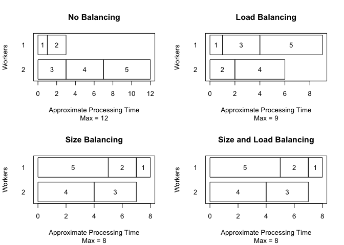

Other considerations
================

## What is going on inside jags.fit

``` r
library(dclone)
```

    ## Loading required package: coda

    ## Loading required package: parallel

    ## Loading required package: Matrix

    ## dclone 2.3-2      2023-07-02

``` r
n = 30
X1 = rnorm(n)
X = model.matrix(~X1)
beta.true = c(0.5, 1)
link_mu = X %*% beta.true

# Linear regression model
mu = link_mu
sigma.e = 1
Y = rnorm(n,mean=mu,sd=sigma.e)

Normal.model = function(){
  # Likelihood 
  for (i in 1:n){
    mu[i] <- X[i,] %*% beta
    Y[i] ~ dnorm(mu[i],prec.e)
  }
  # Prior
  beta[1] ~ dnorm(0, 1)
  beta[2] ~ dnorm(0, 1)
  prec.e ~ dlnorm(0, 1)
}

dat = list(Y=Y, X=X, n=n)

Normal.Bayes = jags.fit(data=dat, params=c("beta","prec.e"), model=Normal.model)
```

    ## Registered S3 method overwritten by 'R2WinBUGS':
    ##   method            from  
    ##   as.mcmc.list.bugs dclone

    ## Compiling model graph
    ##    Resolving undeclared variables
    ##    Allocating nodes
    ## Graph information:
    ##    Observed stochastic nodes: 30
    ##    Unobserved stochastic nodes: 3
    ##    Total graph size: 157
    ## 
    ## Initializing model

What just happened? `jags.fit` is a wrapper around some rjags functions.

``` r
m <- jagsModel(file = Normal.model, data=dat, n.chains=3)
```

    ## Compiling model graph
    ##    Resolving undeclared variables
    ##    Allocating nodes
    ## Graph information:
    ##    Observed stochastic nodes: 30
    ##    Unobserved stochastic nodes: 3
    ##    Total graph size: 157
    ## 
    ## Initializing model

``` r
m
```

    ## JAGS model:
    ## 
    ## model
    ## {
    ##     for (i in 1:n) {
    ##         mu[i] <- X[i, ] %*% beta
    ##         Y[i] ~ dnorm(mu[i], prec.e)
    ##     }
    ##     beta[1] ~ dnorm(0.00000E+00, 1)
    ##     beta[2] ~ dnorm(0.00000E+00, 1)
    ##     prec.e ~ dlnorm(0.00000E+00, 1)
    ## }
    ## Fully observed variables:
    ##  X Y n

``` r
str(m)
```

    ## List of 8
    ##  $ ptr      :function ()  
    ##  $ data     :function ()  
    ##  $ model    :function ()  
    ##  $ state    :function (internal = FALSE)  
    ##  $ nchain   :function ()  
    ##  $ iter     :function ()  
    ##  $ sync     :function ()  
    ##  $ recompile:function ()  
    ##  - attr(*, "class")= chr "jags"

``` r
str(m$state())
```

    ## List of 3
    ##  $ :List of 2
    ##   ..$ beta  : num [1:2] 0.42 0.768
    ##   ..$ prec.e: num 1.01
    ##  $ :List of 2
    ##   ..$ beta  : num [1:2] 0.63 1.07
    ##   ..$ prec.e: num 0.642
    ##  $ :List of 2
    ##   ..$ beta  : num [1:2] 0.465 0.961
    ##   ..$ prec.e: num 0.803

``` r
m$iter()
```

    ## [1] 1000

``` r
update(m, n.iter=1000)
str(m$state())
```

    ## List of 3
    ##  $ :List of 2
    ##   ..$ beta  : num [1:2] 0.295 1.38
    ##   ..$ prec.e: num 0.746
    ##  $ :List of 2
    ##   ..$ beta  : num [1:2] 0.793 1.138
    ##   ..$ prec.e: num 1.31
    ##  $ :List of 2
    ##   ..$ beta  : num [1:2] 0.465 1.023
    ##   ..$ prec.e: num 0.921

``` r
m$iter()
```

    ## [1] 2000

``` r
s = codaSamples(m, variable.names=c("beta","prec.e"), n.iter=5000)
str(s)
```

    ## List of 3
    ##  $ : 'mcmc' num [1:5000, 1:3] 0.276 0.79 0.334 0.584 0.764 ...
    ##   ..- attr(*, "dimnames")=List of 2
    ##   .. ..$ : NULL
    ##   .. ..$ : chr [1:3] "beta[1]" "beta[2]" "prec.e"
    ##   ..- attr(*, "mcpar")= num [1:3] 2001 7000 1
    ##  $ : 'mcmc' num [1:5000, 1:3] 0.101 0.471 0.512 0.922 0.51 ...
    ##   ..- attr(*, "dimnames")=List of 2
    ##   .. ..$ : NULL
    ##   .. ..$ : chr [1:3] "beta[1]" "beta[2]" "prec.e"
    ##   ..- attr(*, "mcpar")= num [1:3] 2001 7000 1
    ##  $ : 'mcmc' num [1:5000, 1:3] 0.181 0.367 0.477 0.575 0.204 ...
    ##   ..- attr(*, "dimnames")=List of 2
    ##   .. ..$ : NULL
    ##   .. ..$ : chr [1:3] "beta[1]" "beta[2]" "prec.e"
    ##   ..- attr(*, "mcpar")= num [1:3] 2001 7000 1
    ##  - attr(*, "class")= chr "mcmc.list"

``` r
head(s)
```

    ## [[1]]
    ## Markov Chain Monte Carlo (MCMC) output:
    ## Start = 2001 
    ## End = 2007 
    ## Thinning interval = 1 
    ##        beta[1]   beta[2]    prec.e
    ## [1,] 0.2756970 1.2158726 0.7249760
    ## [2,] 0.7902739 1.2859910 0.9402355
    ## [3,] 0.3341997 0.9078096 0.8117181
    ## [4,] 0.5837028 0.9924099 1.0679970
    ## [5,] 0.7639234 0.6770830 0.9426667
    ## [6,] 0.1721795 1.1148637 0.7729708
    ## [7,] 0.5536997 0.8784371 1.2930032
    ## 
    ## [[2]]
    ## Markov Chain Monte Carlo (MCMC) output:
    ## Start = 2001 
    ## End = 2007 
    ## Thinning interval = 1 
    ##        beta[1]   beta[2]    prec.e
    ## [1,] 0.1006241 0.8901726 0.8472813
    ## [2,] 0.4712922 0.6978832 0.7704184
    ## [3,] 0.5124813 1.0842301 0.7929726
    ## [4,] 0.9218248 0.8081781 0.8678118
    ## [5,] 0.5097403 1.1019854 0.7321608
    ## [6,] 0.4525129 1.0348321 1.1647179
    ## [7,] 0.5319580 1.1103356 1.2443710
    ## 
    ## [[3]]
    ## Markov Chain Monte Carlo (MCMC) output:
    ## Start = 2001 
    ## End = 2007 
    ## Thinning interval = 1 
    ##        beta[1]   beta[2]    prec.e
    ## [1,] 0.1806287 1.0263623 1.3929086
    ## [2,] 0.3665427 1.1963912 0.8681236
    ## [3,] 0.4765522 0.3232477 1.1127531
    ## [4,] 0.5749661 1.0025116 1.0435970
    ## [5,] 0.2042655 1.0514766 0.8111097
    ## [6,] 0.1053555 0.9235834 0.7649244
    ## [7,] 0.1555669 1.0726393 0.7097508

``` r
m$iter()
```

    ## [1] 7000

``` r
update(m, n.iter=1000)
m$iter()
```

    ## [1] 8000

``` r
s = codaSamples(m, variable.names=c("beta","prec.e"), n.iter=5000)
head(s)
```

    ## [[1]]
    ## Markov Chain Monte Carlo (MCMC) output:
    ## Start = 8001 
    ## End = 8007 
    ## Thinning interval = 1 
    ##        beta[1]   beta[2]    prec.e
    ## [1,] 0.4322917 0.8671456 1.0368098
    ## [2,] 0.2738834 0.9713028 1.1415814
    ## [3,] 0.3583635 1.1150093 0.8619474
    ## [4,] 0.6892203 0.8519869 1.0369857
    ## [5,] 0.4648993 0.8613699 1.0829030
    ## [6,] 0.6941805 0.7563614 1.0835522
    ## [7,] 0.4972914 0.8002717 0.7990990
    ## 
    ## [[2]]
    ## Markov Chain Monte Carlo (MCMC) output:
    ## Start = 8001 
    ## End = 8007 
    ## Thinning interval = 1 
    ##        beta[1]   beta[2]    prec.e
    ## [1,] 0.5785532 1.1909701 1.0532768
    ## [2,] 0.7036063 1.1118787 1.0547839
    ## [3,] 0.4355126 0.9580230 1.2424500
    ## [4,] 0.4306627 1.2888033 0.7050576
    ## [5,] 0.2372114 0.7993467 0.7204302
    ## [6,] 0.2350614 0.9719789 1.3484467
    ## [7,] 0.2218758 1.3642498 0.8103398
    ## 
    ## [[3]]
    ## Markov Chain Monte Carlo (MCMC) output:
    ## Start = 8001 
    ## End = 8007 
    ## Thinning interval = 1 
    ##        beta[1]   beta[2]    prec.e
    ## [1,] 0.5814301 0.7746533 1.5435327
    ## [2,] 0.4024955 0.6092107 1.5200282
    ## [3,] 0.3030160 0.9899251 1.2500865
    ## [4,] 0.2229423 0.9964855 0.8923915
    ## [5,] 0.3355943 0.9551258 0.5966687
    ## [6,] 0.5623622 0.7677455 1.1399829
    ## [7,] 0.5313038 1.1730838 0.6139457

``` r
m$iter()
```

    ## [1] 13000

Can we further update `Normal.Bayes`?

``` r
m2 <- updated.model(Normal.Bayes)
m2$iter()
```

    ## [1] 7000

``` r
update(m2, n.iter=1000)
m2$iter()
```

    ## [1] 8000

Couple of things to cover here:

``` r
str(formals(jags.fit))
```

    ## Dotted pair list of 11
    ##  $ data         : symbol 
    ##  $ params       : symbol 
    ##  $ model        : symbol 
    ##  $ inits        : NULL
    ##  $ n.chains     : num 3
    ##  $ n.adapt      : num 1000
    ##  $ n.update     : num 1000
    ##  $ thin         : num 1
    ##  $ n.iter       : num 5000
    ##  $ updated.model: logi TRUE
    ##  $ ...          : symbol

Implicitly, we do:

``` r
Normal.Bayes = jags.fit(
    data=dat, 
    params=c("beta","prec.e"),
    model=Normal.model,
    inits=NULL,
    n.chains=3,
    n.adapt=1000,
    n.update=1000,
    thin=1,
    n.iter=5000,
    updated.model=TRUE)
```

    ## Compiling model graph
    ##    Resolving undeclared variables
    ##    Allocating nodes
    ## Graph information:
    ##    Observed stochastic nodes: 30
    ##    Unobserved stochastic nodes: 3
    ##    Total graph size: 157
    ## 
    ## Initializing model

## Working with MCMC lists

``` r
mcmcapply(Normal.Bayes, sd)
```

    ##   beta[1]   beta[2]    prec.e 
    ## 0.1922163 0.2131005 0.2371114

``` r
mcmcapply(Normal.Bayes, quantile, c(0.05, 0.5, 0.95))
```

    ##       beta[1]   beta[2]    prec.e
    ## 5%  0.1429305 0.6207693 0.5673785
    ## 50% 0.4613663 0.9740756 0.8962162
    ## 95% 0.7705325 1.3189385 1.3474603

``` r
quantile(Normal.Bayes, c(0.05, 0.5, 0.95))
```

    ##       beta[1]   beta[2]    prec.e
    ## 5%  0.1429305 0.6207693 0.5673785
    ## 50% 0.4613663 0.9740756 0.8962162
    ## 95% 0.7705325 1.3189385 1.3474603

``` r
str(as.matrix(Normal.Bayes))
```

    ##  num [1:15000, 1:3] 0.634 0.411 0.518 0.46 0.453 ...
    ##  - attr(*, "dimnames")=List of 2
    ##   ..$ : NULL
    ##   ..$ : chr [1:3] "beta[1]" "beta[2]" "prec.e"

## We need to talk about RNGs

``` r
library(rjags)
```

    ## Warning: package 'rjags' was built under R version 4.4.1

    ## Linked to JAGS 4.3.1

    ## Loaded modules: basemod,bugs

``` r
str(parallel.seeds("base::BaseRNG", 5))
```

    ## List of 5
    ##  $ :List of 2
    ##   ..$ .RNG.name : chr "base::Marsaglia-Multicarry"
    ##   ..$ .RNG.state: int [1:2] 401046351 953303131
    ##  $ :List of 2
    ##   ..$ .RNG.name : chr "base::Super-Duper"
    ##   ..$ .RNG.state: int [1:2] 927607820 -163782997
    ##  $ :List of 2
    ##   ..$ .RNG.name : chr "base::Mersenne-Twister"
    ##   ..$ .RNG.state: int [1:625] 1 -1263690803 -1188286620 -1819575478 -2074277195 1930869263 -618800362 -1470794304 1490593155 -1609634911 ...
    ##  $ :List of 2
    ##   ..$ .RNG.name : chr "base::Wichmann-Hill"
    ##   ..$ .RNG.state: int [1:3] 3021 5787 7527
    ##  $ :List of 2
    ##   ..$ .RNG.name : chr "base::Marsaglia-Multicarry"
    ##   ..$ .RNG.state: int [1:2] 1822220490 223544395

``` r
## The lecuyer module provides the RngStream factory, which allows large
## numbers of independent parallel RNGs to be generated. 
load.module("lecuyer")
```

    ## module lecuyer loaded

``` r
list.factories(type="rng")
```

    ##              factory status
    ## 1 lecuyer::RngStream   TRUE
    ## 2      base::BaseRNG   TRUE

``` r
str(parallel.seeds("lecuyer::RngStream", 5))
```

    ## List of 5
    ##  $ :List of 2
    ##   ..$ .RNG.name : chr "lecuyer::RngStream"
    ##   ..$ .RNG.state: int [1:6] -1777709828 -2104787782 31770792 1261665350 143085332 -687586158
    ##  $ :List of 2
    ##   ..$ .RNG.name : chr "lecuyer::RngStream"
    ##   ..$ .RNG.state: int [1:6] -1774952987 2050797795 -614709316 -589992281 -47353143 1239355736
    ##  $ :List of 2
    ##   ..$ .RNG.name : chr "lecuyer::RngStream"
    ##   ..$ .RNG.state: int [1:6] 1328011975 -1307460630 716218479 -1118618765 77121299 2093911428
    ##  $ :List of 2
    ##   ..$ .RNG.name : chr "lecuyer::RngStream"
    ##   ..$ .RNG.state: int [1:6] -419739181 -559616523 1550860553 764027362 681424113 -1480311856
    ##  $ :List of 2
    ##   ..$ .RNG.name : chr "lecuyer::RngStream"
    ##   ..$ .RNG.state: int [1:6] -196138040 1872357611 1837572188 -853559055 -723909643 391488506

## Can we run chains in parallel?

``` r
system.time({
    Normal.Bayes = jags.fit(
        data=dat, params=c("beta","prec.e"), model=Normal.model,
        n.chains=4,
        n.update=10^6)
})
```

    ## Compiling model graph
    ##    Resolving undeclared variables
    ##    Allocating nodes
    ## Graph information:
    ##    Observed stochastic nodes: 30
    ##    Unobserved stochastic nodes: 3
    ##    Total graph size: 157
    ## 
    ## Initializing model

    ##    user  system elapsed 
    ##  19.006   0.013  19.141

``` r
if (.Platform$OS.type != "windows") {
system.time({
    Normal.Bayes = jags.parfit(
        cl=10,
        data=dat, params=c("beta","prec.e"), model=Normal.model,
        n.chains=4,
        n.update=10^6)
})
}
```

    ## 
    ## Parallel computation in progress

    ##    user  system elapsed 
    ##  14.586   0.077   4.967

## I like DC but I don’t have time …

Well, check `dc.parfit`

``` r
## determine the number of workers needed
clusterSize(1:5)
```

    ##   workers none load size both
    ## 1       1   15   15   15   15
    ## 2       2   12    9    8    8
    ## 3       3    9    7    5    5
    ## 4       4    7    6    5    5
    ## 5       5    5    5    5    5

``` r
## visually compare balancing options
opar <- par(mfrow=c(2, 2))
plotClusterSize(2,1:5, "none")
plotClusterSize(2,1:5, "load")
plotClusterSize(2,1:5, "size")
plotClusterSize(2,1:5, "both")
```

<!-- -->

``` r
par(opar)
```

Parallel chains, size balancing, both.
